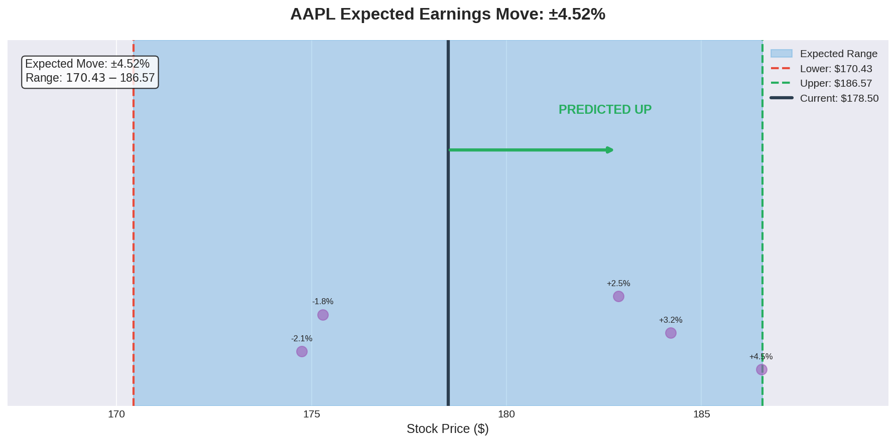
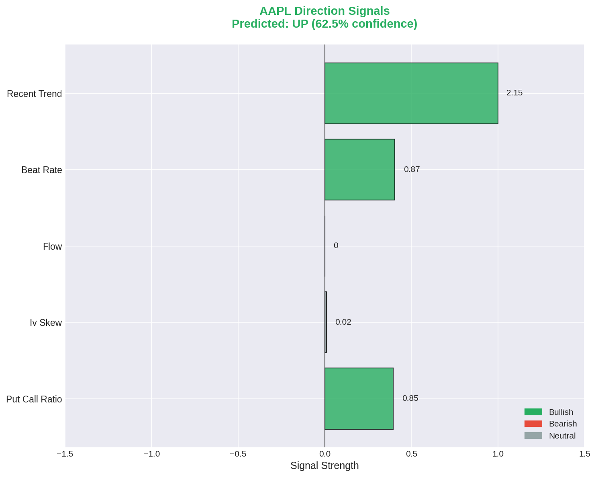
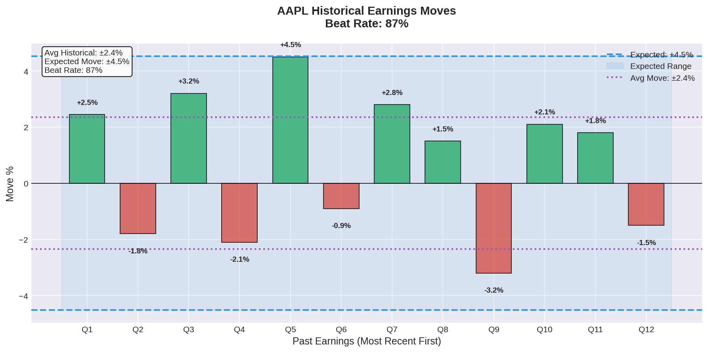
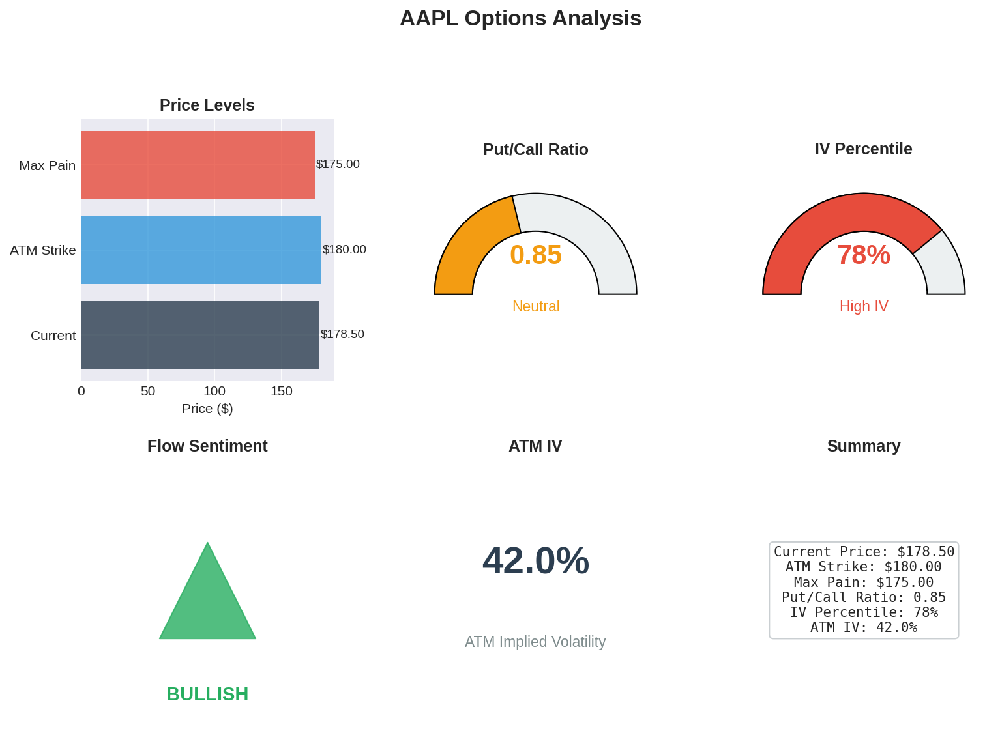
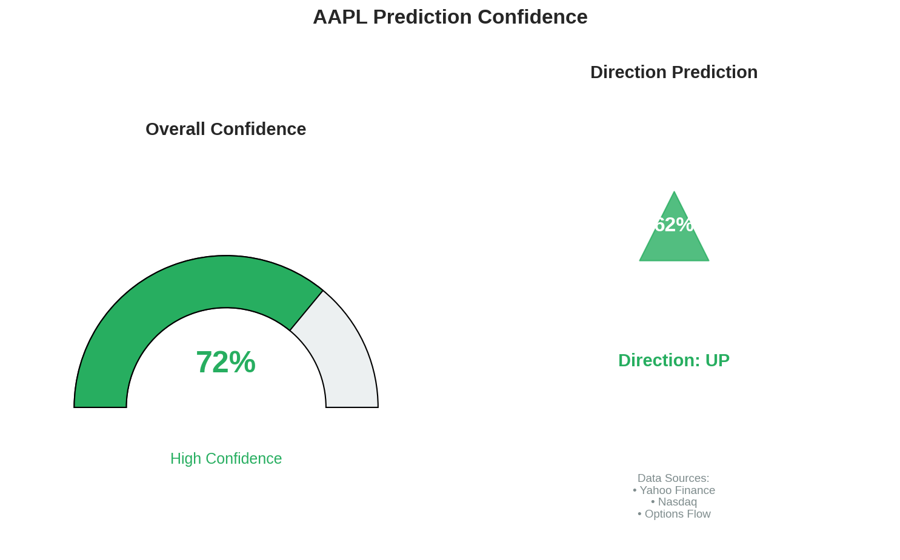

# Earnings Move Predictor

A comprehensive Python tool for predicting stock movements after earnings announcements using options chain data, implied volatility analysis, and multiple data sources.

## Features

- **Expected Move Calculation**: Calculate implied expected moves from ATM straddle pricing
- **Multiple Data Sources**:
  - Free: Yahoo Finance, Nasdaq, web scraping
  - Premium: Unusual Whales, Trading Economics, Polygon, Alpha Vantage, Interactive Brokers
- **Options Analysis**: Complete options chain analysis with Greeks, IV skew, and max pain
- **Flow Analysis**: Track unusual options activity and institutional positioning
- **Direction Prediction**: ML-based direction prediction using multiple signals
- **Historical Context**: Compare implied moves to historical earnings reactions
- **Visual Charts**: Generate comprehensive visualization plots for analysis

## Installation

### Basic Installation (Free Mode)

```bash
# Clone the repository
git clone https://github.com/yourusername/Predicting-earnings-move.git
cd Predicting-earnings-move

# Install dependencies
pip install -r requirements.txt

# Install the package
pip install -e .
```

### Premium Installation

```bash
# Install with premium dependencies
pip install -r requirements-premium.txt
pip install -e ".[premium]"
```

## Quick Start

### Command Line Interface

```bash
# Predict expected move for a single stock
earnings-predict predict AAPL

# Batch prediction for multiple stocks
earnings-predict batch AAPL MSFT GOOGL NVDA

# Get earnings calendar
earnings-predict calendar --days 7

# Detailed options analysis
earnings-predict options TSLA

# Check configuration status
earnings-predict status

# Use premium mode (requires API keys)
earnings-predict --mode premium predict AAPL

# Generate visualization plots
earnings-predict predict AAPL --format plot

# Save plots to custom directory
earnings-predict predict AAPL --format plot --output-dir ./my_charts
```

### Python API

```python
from src.main import EarningsMovePredictor

# Initialize predictor (free mode)
predictor = EarningsMovePredictor(mode='free')

# Get prediction
prediction = predictor.predict_single('AAPL')

print(f"Expected Move: ±{prediction.expected_move_percent:.2f}%")
print(f"Expected Range: ${prediction.expected_range[0]:.2f} - ${prediction.expected_range[1]:.2f}")
print(f"Direction: {prediction.predicted_direction}")
print(f"Confidence: {prediction.overall_confidence*100:.0f}%")
```

### Low-Level API

```python
from src.data_sources.free_sources import YahooFinanceSource
from src.analysis.options_analyzer import OptionsAnalyzer
from src.analysis.expected_move import ExpectedMoveCalculator

# Get option chain
yahoo = YahooFinanceSource()
chain = yahoo.get_option_chain('MSFT')

# Analyze options
analyzer = OptionsAnalyzer()
metrics = analyzer.analyze_chain(chain)

print(f"ATM IV: {metrics.atm_iv*100:.1f}%")
print(f"Put/Call Ratio: {metrics.put_call_ratio:.2f}")
print(f"Max Pain: ${metrics.max_pain_strike:.2f}")

# Calculate expected move
calc = ExpectedMoveCalculator(analyzer)
expected_move = calc.calculate_expected_move(chain)

print(f"Expected Move: ±{expected_move.expected_move_percent:.2f}%")
```

## Visualizations

The tool generates comprehensive visual charts to help you understand earnings predictions at a glance. Use `--format plot` to generate these visualizations.

### Expected Move Range

Shows the predicted price range after earnings with the current price, upper/lower bounds, and direction indicator.



**What it shows:**
- **Blue shaded area**: The expected price range based on ATM straddle pricing
- **Green dashed line**: Upper bound of expected move
- **Red dashed line**: Lower bound of expected move
- **Black solid line**: Current stock price
- **Direction arrow**: Predicted direction (UP/DOWN) based on multiple signals
- **Purple dots**: Historical earnings moves for context

---

### Direction Signals Analysis

Breaks down the individual signals contributing to the direction prediction.



**What it shows:**
- **Put/Call Ratio**: Low ratio (<0.7) is bullish, high ratio (>1.3) is bearish
- **IV Skew**: Higher put IV suggests bearish sentiment
- **Options Flow**: Net bullish vs bearish institutional trades
- **Beat Rate**: Historical earnings beat percentage
- **Recent Trend**: Momentum from recent quarters
- **Color coding**: Green = Bullish, Red = Bearish, Gray = Neutral

---

### Historical Earnings Moves

Compares the current expected move against historical earnings reactions.



**What it shows:**
- **Bar chart**: Past 12 quarters of earnings moves (green = positive, red = negative)
- **Blue dashed lines**: Current expected move range
- **Purple dotted lines**: Average historical move
- **Beat Rate**: Percentage of quarters where company beat estimates

---

### Options Analysis Dashboard

A comprehensive dashboard of key options metrics.



**What it shows:**
- **Price Levels**: Current price, ATM strike, and max pain comparison
- **Put/Call Ratio Gauge**: Visual indicator with bullish/bearish/neutral zones
- **IV Percentile Gauge**: Where current IV ranks historically (0-100%)
- **Flow Sentiment**: Overall institutional positioning direction
- **ATM IV**: At-the-money implied volatility percentage
- **Summary Stats**: All key metrics in one place

---

### Probability Cone

Visualizes price ranges at different probability levels.


**What it shows:**
- **50% Confidence**: Inner range - price has 50% chance of landing here
- **68% Confidence**: Middle range - one standard deviation (1-sigma)
- **95% Confidence**: Outer range - two standard deviations (2-sigma)
- **Cone shape**: Illustrates uncertainty expanding from current price

---

### Confidence Gauge

Shows overall prediction confidence and direction certainty.



**What it shows:**
- **Overall Confidence**: Prediction quality based on data availability and consistency
- **Direction Prediction**: UP/DOWN indicator with confidence percentage
- **Data Sources**: Which sources contributed to the analysis

---

### Generating Visualizations

#### Command Line

```bash
# Generate plots for a single stock
earnings-predict predict AAPL --format plot

# Save to custom directory
earnings-predict predict TSLA --format plot --output-dir ./analysis/tsla
```

#### Python API

```python
from src.main import EarningsMovePredictor
from src.visualization import create_prediction_dashboard, save_prediction_plots

# Get prediction
predictor = EarningsMovePredictor(mode='free')
prediction = predictor.predict_single('AAPL', output_format='text')

# Generate all plots
figures = create_prediction_dashboard(prediction, save_dir='./plots')

# Or save directly
saved_files = save_prediction_plots(prediction, './plots/aapl')
```

#### Individual Plot Functions

```python
from src.visualization import (
    plot_expected_move_range,
    plot_direction_signals,
    plot_historical_moves,
    plot_options_analysis,
    plot_probability_cone,
    plot_confidence_gauge
)

# Generate specific plots
fig = plot_expected_move_range(
    symbol='AAPL',
    current_price=178.50,
    expected_move_percent=4.52,
    expected_range=(170.43, 186.57),
    predicted_direction='up',
    save_path='./my_plot.png'
)
```

## Configuration

### Environment Variables

Create a `.env` file from the template:

```bash
cp .env.example .env
```

Available API keys:

```
UNUSUAL_WHALES_API_KEY=your_key_here
TRADING_ECONOMICS_API_KEY=your_key_here
POLYGON_API_KEY=your_key_here
ALPHA_VANTAGE_API_KEY=your_key_here
```

### Configuration File

Copy and modify the example config:

```bash
cp config/config.example.json config/config.json
```

## How It Works

### Expected Move Calculation

The expected move is primarily calculated from the ATM (at-the-money) straddle price:

```
Expected Move % = (ATM Straddle Price / Stock Price) × 100
```

This represents what the options market is implying the stock will move after earnings.

### Direction Prediction

Direction is predicted using multiple signals:

1. **Put/Call Ratio**: Heavy call buying suggests bullish sentiment
2. **IV Skew**: Higher put IV indicates more demand for downside protection
3. **Options Flow**: Institutional sweep/block orders indicate smart money direction
4. **Historical Beat Rate**: Consistent earnings beats suggest upward bias
5. **Recent Trend**: Recent price momentum

### Data Sources

#### Free Sources
- **Yahoo Finance**: Options chains, stock data, earnings dates
- **Nasdaq**: Earnings calendar and estimates
- **Earnings Whispers**: Whisper numbers and sentiment
- **Barchart**: Unusual options activity (scraped)

#### Premium Sources
- **Unusual Whales**: Real-time options flow and unusual activity
- **Trading Economics**: Economic calendar and earnings data
- **Polygon.io**: High-quality options data
- **Alpha Vantage**: Earnings estimates and historical data
- **Interactive Brokers**: Real-time options chains

## Project Structure

```
Predicting-earnings-move/
├── src/
│   ├── __init__.py
│   ├── main.py                  # Main application & CLI
│   ├── data_sources/
│   │   ├── __init__.py
│   │   ├── base.py              # Base classes
│   │   ├── free_sources.py      # Free data sources
│   │   └── premium_sources.py   # Premium API sources
│   ├── analysis/
│   │   ├── __init__.py
│   │   ├── options_analyzer.py  # Options chain analysis
│   │   ├── expected_move.py     # Expected move calculator
│   │   └── earnings_predictor.py # Main prediction engine
│   └── visualization/
│       ├── __init__.py
│       └── plots.py             # Visualization charts & plots
├── examples/
│   ├── basic_usage.py
│   ├── advanced_usage.py
│   ├── generate_sample_plots.py # Generate example plots
│   └── plots/                   # Sample visualization outputs
│       ├── expected_move_range.png
│       ├── direction_signals.png
│       ├── historical_moves.png
│       ├── options_analysis.png
│       ├── probability_cone.png
│       └── confidence_gauge.png
├── config/
│   └── config.example.json
├── requirements.txt
├── requirements-premium.txt
├── setup.py
└── README.md
```

## Examples

### Calculate IV-Based Expected Move

```python
from src.analysis.expected_move import ExpectedMoveCalculator

calc = ExpectedMoveCalculator()

# Stock at $150 with 45% IV
move_dollars, move_pct = calc.calculate_from_iv(150.0, 0.45, days=1)
print(f"Expected Move: ±${move_dollars:.2f} (±{move_pct:.2f}%)")
```

### Probability Cone Analysis

```python
cone = calc.calculate_probability_cone(
    underlying_price=150.0,
    implied_volatility=0.45,
    days=1,
    confidence_levels=[0.5, 0.68, 0.95]
)

for conf, (lower, upper) in cone.items():
    print(f"{conf*100:.0f}% confidence: ${lower:.2f} - ${upper:.2f}")
```

### Strategy Analysis

```python
# Iron Condor based on expected move
# See examples/advanced_usage.py for full implementation
```

## Output Format

### Text Output
```
============================================================
EARNINGS PREDICTION: AAPL
============================================================
Current Price: $175.50
Earnings Date: 2024-01-25 (AMC)

EXPECTED MOVE:
  Range: ±4.52%
  Price Range: $167.57 - $183.43

DIRECTION PREDICTION:
  Direction: UP
  Confidence: 62.5%

OPTIONS ANALYSIS:
  IV Percentile: 78.5%
  Flow Sentiment: bullish
  Put/Call Ratio: 0.85
  Max Pain: $175.00

HISTORICAL CONTEXT:
  Avg Historical Move: ±3.89%
  Last Earnings Move: +2.45%
  Beat Rate: 87%

Overall Confidence: 72%
Data Sources: Yahoo Finance, Nasdaq
============================================================
```

### JSON Output

```bash
earnings-predict predict AAPL --format json
```

## Limitations

- Options data may have delays (15-20 min for free sources)
- Historical moves are approximations from earnings surprise data
- Direction prediction is probabilistic, not guaranteed
- Premium data sources provide better accuracy and speed

## Contributing

Contributions are welcome! Please read the contributing guidelines before submitting PRs.

## License

MIT License - see LICENSE file for details.

## Disclaimer

This tool is for educational and informational purposes only. It does not constitute financial advice. Options trading involves significant risk of loss. Always do your own research and consult with a qualified financial advisor before making investment decisions.
